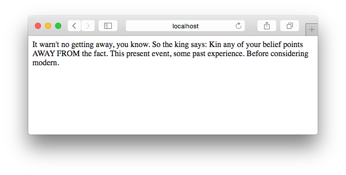
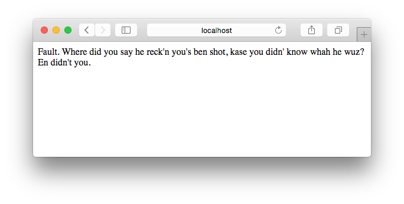

By this point, we've built a working program. Which is great. But wouldn't it be better if the whole world could use it, instead of just us?

Yes. Yes it would.
Let's put it on the web.

In this tutorial, we're going to use the [Flask](http://flask.pocoo.org/) micro-framework to make a small web application where the generated text can be displayed. Eventually, we'll even use this web application to connect with the Twitter API and tweet out the best generated sentences. But let's not get ahead of ourselves, let's build this one step at a time.

If you're unfamiliar with Flask, that's fine – you'll be able to pick it up quickly. There are [lots](http://blog.miguelgrinberg.com/post/the-flask-mega-tutorial-part-i-hello-world) [of](https://realpython.com/blog/python/flask-by-example-part-1-project-setup/) [resources](https://exploreflask.com/) to get you up and running quickly. For the purposes of this tutorial, you'll need to learn only the basics of Flask. If you want to learn more (to make your app even better), by all means go ahead and do so.

The goal for this tutorial is to create a web app with an index or home route that displays a freshly-generated word with each page load. We'll develop this web application locally first, and then publish to Heroku later so that anyone on the web can see it.

Environment Setup
==

Before we begin working on the project code, we need to do some work to set up a proper development environment.

When programming, it is common to work on code that will be executed on other computers with their own _environments_ (different operating system, languages and libraries installed, etc.). To ensure that our code will run on other machines, it is important to be clear and explicit about the environmental requirements that our code has. These environmental requirements include things like (in the case of Python):

* Which version of Python do our programs expect?
* Which version of pip (the Python package manager) are we using?
* What libraries and which versions of those libraries do our programs rely upon?

In the world of Python, a commonly accepted solution to the problem of environment management is to use the [virtualenv](https://virtualenv.pypa.io/) tool. Virtualenv is "a tool to create isolated Python environments", meaning that if you use it correctly, you can be sure that you are using _only_ the dependencies specified, and nothing more.

For our purposes, we'll be using `virtualenv` to ensure that we use the right version of Python to execute our programs and that the packages we install with `pip` will be isolated from our larger development environments (i.e. the other programs and applications on our computer). What this means is that we'll be able to use the `python` command to run programs with only the version we've specified, and all packages we install with `pip` will be installed into a local directory, not a global one.

Use this tutorial to a virtual environment set up with `virtualenv`, though you can [read more about virtual environments in Python in this Python Guide](http://docs.python-guide.org/en/latest/dev/virtualenvs/).

To start, follow the [installation instructions](https://virtualenv.pypa.io/en/latest/installation.html) to get yourself a copy of the `virtualenv` program. To verify that you've installed correctly, run the command `$ which virtualenv` and you should see the path for the virtualenv executable.

Once we have the `virtualenv` command installed, we will use it to create a new virtual environment in a subdirectory of our project called `venv`. However, we also want to make sure that we create a virtual environment using the correct version of Python. So we'll use the `-p` flag of the `virtualenv` command to specify a Python interpreter to use.

First, find out the file path to Python by running this command:

	$ which python

On my machine, this outputs `/usr/local/bin/python`, but it might be different for you.

Then, run the `virtualenv` command supplying the path to the Python interpreter with the `-p` flag, followed by the name of the virtual environment directory, in this case `venv`:

	$ virtualenv -p /path/to/python venv

You should see some nice logging output telling you what `virtualenv` is doing.

There is still one more step before `virtualenv` is activated, i.e. before we are _actually_ using our virtual environment instead of our regular one. We need to activate it! Run this command to activate:

	$ source venv/bin/activate

Read up on the [activate script](https://virtualenv.pypa.io/en/latest/userguide.html#activate-script) to learn more about what it does, and try this experiment to prove that it worked:

1. Open two separate command shells (if you're using Terminal.app on a Mac, just open two tabs in the same window).
2. Navigate to your same project directory in both shells.
3. In _one_ of the shells, run the command `$ source venv/bin/activate`.
4. In _both_ shells, run the command `$ which python`.

You should see two different outputs: in the shell where you ran the activate script, the output of `$ which python` should be the file path to the `python` executable in `./venv/bin/`, while in the other shell it should output the path to the global Python interpreter.

With a `venv` installed and activated, you can rest assured that the Python interpreter you're using is the one that you've specified. In addition, when you install packages with `pip`, you'll be installing them into the `./venv` subdirectory, which means that other Python projects you have will not affect the packages for this one. Pretty neat!

**A word of warning:** it's easy to forget to run `$ source venv/bin/activate` when starting a new shell. If you find yourself running into strange bugs, make sure that you're using the virtual environment by checking the output of `$ which python`.

Local Development
==
Let's get a local version of our web app running.

The first step is to download and install the Flask library: [instructions](http://flask.pocoo.org/docs/0.11/installation/).

	$ pip install Flask

Next you want to create a new script file that will be responsible for starting your web server. By convention this file is called `app.py`, but you can call it `server.py` or whatever you like.

Start by following the instructions in the [Flask quickstart](http://flask.pocoo.org/docs/0.11/quickstart/) to build the most basic Flask app. Once you get it running, you should be able to open a browser and view your app at http://127.0.0.1:5000/ (read as "port 5000 on host 127.0.0.1").

	$ python app.py
	* Running on http://127.0.0.1:5000/ (Press CTRL+C to quit)
	* Restarting with stat
	...

Now you'll see that you have a working web app that displays some basic text on a page. It should be fairly obvious what we'd have to change so that each page visit displays our *generated text* instead of a hard-coded string.

If you've structured your sentence-generating program as a *module*, then you should be able to import the module and use the appropriate function(s) within your Flask route function.

Once you've done that, on each page visit you'll see a freshly-generated word or sentence, like this (from a bot using *The Adventures of Huckleberry Finn* as its corpus):

It doesn't look super pretty, but we can clean that up later. At least it works!

If you aren't able to get it working, and you're confused because you aren't getting error messages, make sure to enable [debug mode](http://flask.pocoo.org/docs/0.11/quickstart/#debug-mode) for your Flask app.

Push to Heroku
==
Now that we've got a working development version of our app, it's time to put it on the world wide web. We're going to use [Heroku](https://www.heroku.com/), a popular PaaS, or Platform-as-a-Service, to host our deployed web app.

Luckily for us, Heroku has a great guide on getting started with Python apps. Follow this guide to prepare and deploy your app. You don't need to follow all of the steps. The most essential pieces you'll need are:

- A local [Git](https://git-scm.com/) repository for your source code
- A [Heroku account](https://signup.heroku.com/www-home-top)
- [Heroku Toolbelt](https://toolbelt.heroku.com/) installed
- A [Procfile](https://devcenter.heroku.com/articles/procfile) with a `web` process type defined
- A list of [package dependencies defined](https://devcenter.heroku.com/articles/getting-started-with-python#declare-app-dependencies)
- A [specified Python runtime](https://devcenter.heroku.com/articles/python-runtimes)

Once you have all the pieces in place, publishing your app to Heroku is a single command:

	$ git push heroku master

Now all your hard work is viewable, on the internet, all the time, for anyone! Rejoice!

Help! It's Not Working and I Don't Know Why
==
You may run into errors along the way. It doesn't always work smoothly the first time.

That's fine, no problem. Stay calm, read the error message, and [check your Heroku logs](https://devcenter.heroku.com/articles/getting-started-with-python#view-logs).

Google error messages. Ask for help. We're going to get through this.

Some issues to be aware of:

- Heroku expects you to use [virtualenv](https://virtualenv.pypa.io/en/latest/) to manage dependencies with virtual environments
- Heroku expects you to use [foreman](http://ddollar.github.io/foreman/) to start your app (it should be installed automatically with the Heroku Toolbelt)
- Heroku prefers that you use the [Gunicorn HTTP server](http://gunicorn.org/)
- But when you use Gunicorn locally, your Python errors will be "swallowed" (i.e. not displayed in the error page or server log). This [StackOverflow post](http://stackoverflow.com/questions/8950674/debugging-a-flask-app-running-in-gunicorn) covers the issue well, and how to ensure that you can still see errors in development.

Where to Go From Here
==
All finished, with clean and readable code? No? Ok, go do that first. Then, make your web app look better and/or add more features.

- Improve the style of your page (use a nice font, make it bigger, center it, etc.) with CSS.
- Display more than one generated word on the page.
- Generate a specific number of words given in a URL query string parameter. For example, visiting `/?num=10` would generate a set of 10 words.
- Add a button to display a new word (i.e. refresh the page) when clicked.
- Make a "favorite" button and a `/favorites` route to display all the words that have been "favorited" by users. This is advanced stuff: you'll need to use a database. Not for the faint of heart.
